# Pipelined-Processor-using-verilog

In this project, we design, implement and test a **Harvard (separate memories for data and instructions), RISC-like, five-stages pipeline** processor, with the specifications as described in the following sections.

## 5-Stages pipeline processor

namely (Fetch -Decode-Execute-Memory-Write Back). We will simulate a pipeline that issues new instruction after 5-time steps. In every time step, the instruction passes through one of the stages. Each instruction should walk through the complete 5 stages even if it doesn’t need to do anything in some of the stages.

## Memory units and registers description

In this project, we apply a Harvard architecture with two memory units; **Instructions’ memory** and **Data memory.**

The processor in this project has a RISC-like instruction set architecture. There are eight 2-bytes general purpose registers[ R0 to R7]. These registers are separate from the program counter and the stack pointer registers.

The program counter **PC** spans the instructions memory address space that has a total size of **2 Megabytes.** Each memory address has a **16-bit width** (i.e., is word addressable). The instructions memory **starts with the interrupts area** (the very first address space from [0 down to 2^5-1]), **followed by the instructions area** (starting from [2^5 and down to 2^20]) as shown in Figure.1. By default, **the PC is initialized with a value of (2^5)** where the program code starts.

The other memory unit is the **data memory,** which has a total size of **4 Kilobytes** for its own, **16-bit in width** (i.e., is word addressable). The processor can **access both memory units at the same time** without having a memory access hazard.

The **data memory** starts with the data area (the very first address space and down), followed by the stack area (starting from [2^11 − 1 and up]) as shown in Figure.1. By default, **the stack pointer (SP) pointer points to the top of the stack** (the next free address available in the stack), and is initialized by a value of (2^1-1).

## Interrupts

interrupts area is in the very first address space from [0 down to 2^5-1]

When an **interrupt occurs,** the processor **finishes the currently fetched instructions** (instructions that have already entered the pipeline), **save the processor state** (Flags), then **the address of the next instruction (in PC) is saved on top of the stack,** and **PC is loaded from address 0** of the memory where the interrupt code resides.

We have **only one interrupt program,** the one which starts at the top of the instruction’s memory

To **return from an interrupt,** an RTI instruction **loads the PC from the top of stack,** **restores the processor state (Flags),** and the flow of the program resumes from the instruction that was supposed to be fetched in-order before handling the interrupted instruction.

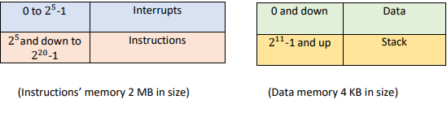

## ISA specifications

**A) Registers:**

○ R[0:7]<15:0> : Eight 16-bit general purpose registers

○ PC<31:0> : 32-bit program counter

○ SP<31:0> : 32-bit stack pointer

○ CCR<3:0> : condition code register that can be divided to

○ Z<0>:=CCR<0> : zero flag, change after arithmetic, logical, or shift operations

○ N<0>:=CCR<1> : negative flag, change after arithmetic, logical, or shift operations

○ C<0>:=CCR<2> : carry flag, change after arithmetic or shift operations.

**B) Input-Output**

○ IN.PORT<15:0> : 16-bit data input port

○ OUT.PORT<15:0> : 16-bit data output port

○ INTR.IN<0> : a single, non-maskable interrupt

○ RESET.IN<0> : reset signal

**C) Other registers to hold the operands and opcodes of the instructions**

○ Rsrc : 1st operand register

○ Rdst : 2nd operand register and result register field

○ Imm : Immediate Value

**D) Instructions (some instructions will occupy more than one memory location)**

## Design

**The whole design**

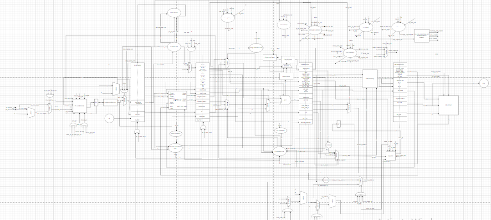

**Fetch Stage**

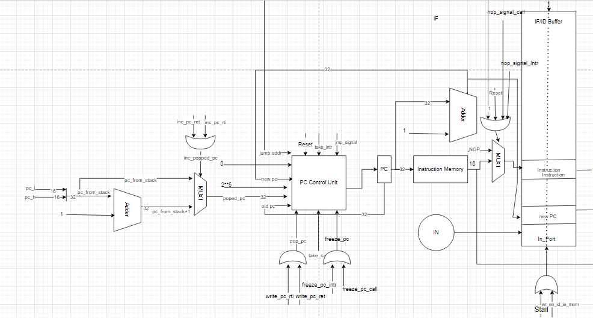

**Decode Stage**

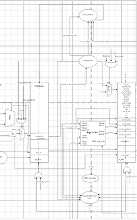

**Execute Stage**

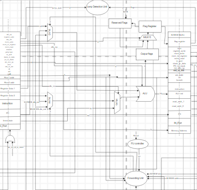

**Memory Stage**

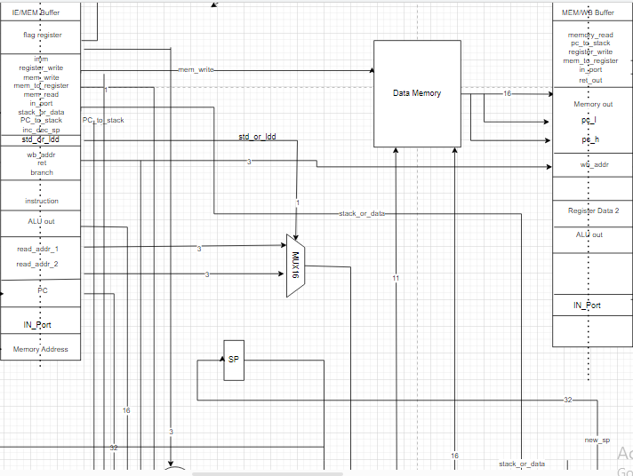

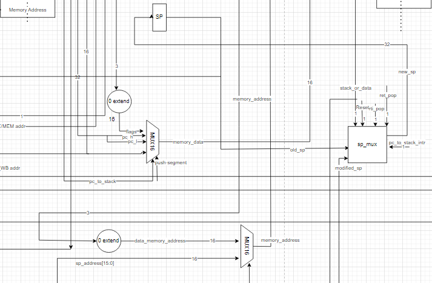

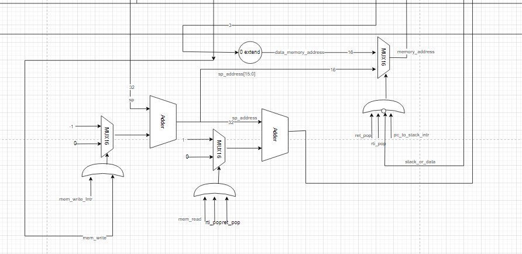

**Write Back Stage**

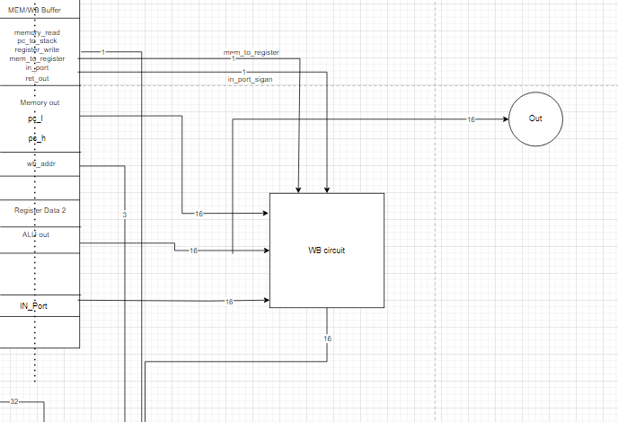

**Interrupt,Call,RET & RTI controllers**

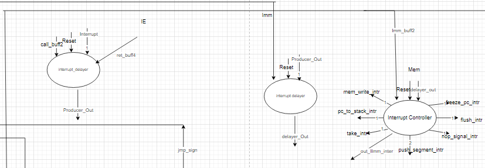

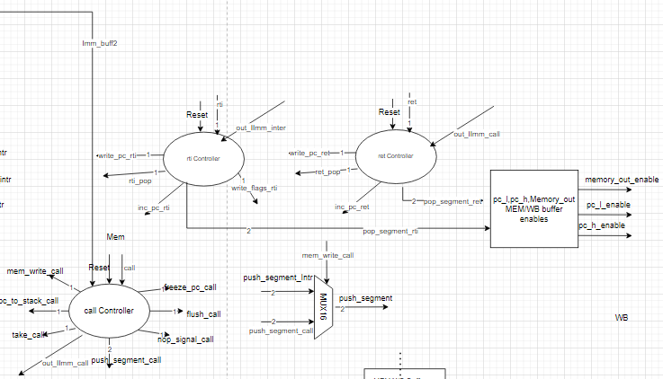

**Hazard detection unit and forwarding unit**

**Flush Controller**

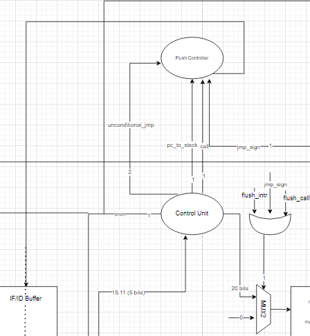

To See more details you can open **'design.drawio'** file in [This Site](https://app.diagrams.net/)

## Instructions format

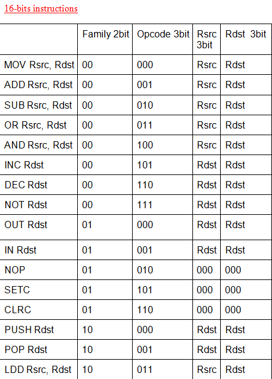

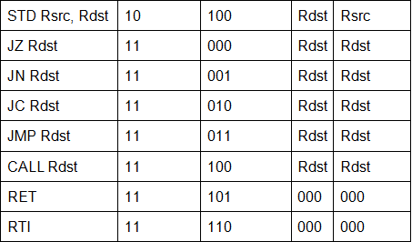

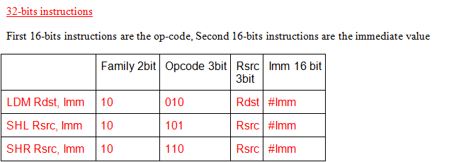

## PC control unit

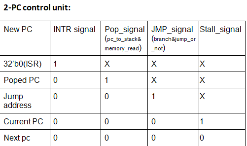

## Entered Instruction in IF/IE buffer:

1-If PC is freezed or the instruction needs Immediate value PC is freezed , Nop is Entered.

2-else it will be the output of instructions memory.

## ALU OpCodes (from decoding stage to ALU)

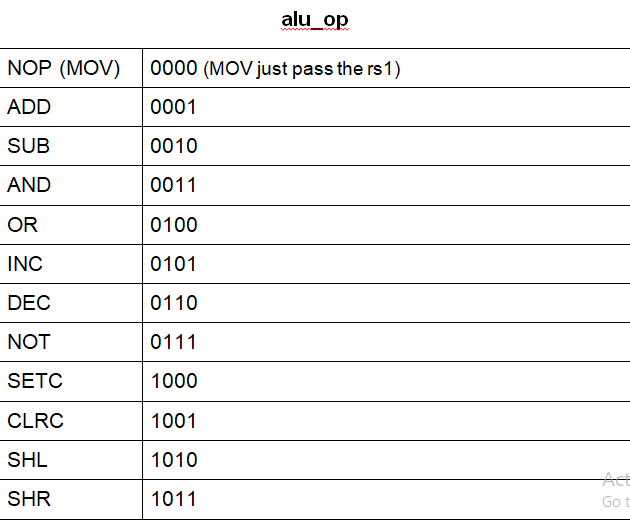

## Full forwarding unit truth table

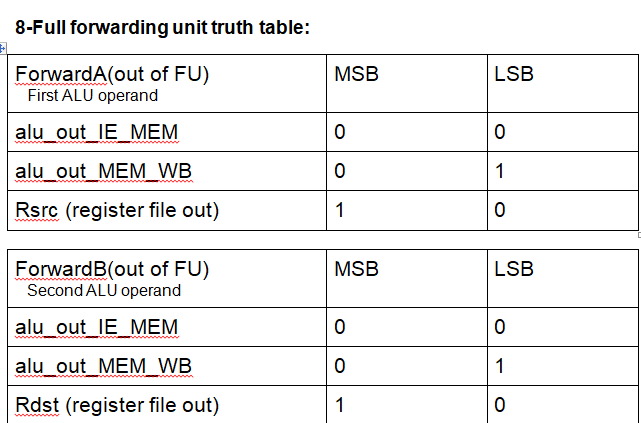

## Handled Hazards

**Control Hazards**: 

We used static branch prediction

**Data Hazards**:

We used full-forwarding 

In **load use case** we stall one cycle.

**Structural Hazards**:

Separate memories for data and instructions (Harvard architecture) 

Writing to registers is in first-half of the clock cycle 7 reading is in the second-half cycle

## Branch predicion

We used **static branch predicion**

## Assembler

Input files are in Assembly language, so we have assembler file to convert **_assembly language_** to **_machine code_** for our ISA specifications

Not sensetive to spaces before/after operand and opcodes

Not case sensetive

No brackets are allowed ==> remove brackets before you run the assembler

Assembler file is in **_Test Cases & Assembler_** folder 

Put the input text file in the the path of the assembler

Set **_file_name_** with input file name

The Interrupt service routine which starts at **_Org0_** till RTI will be in **_isrMEM.txt_** file

The instructions OP_Codes will be in **_instructionMem.txt_**

Instructions starts with **_.ORG_** in our test cases

We don't use first ORG as the project says that instruction memory starts in **_2^5 memory location_**

Any **_ORG_** we insert **_NOP_** instructions with the number of ORG

Comments in input files start with **_#_**

## Test Cases

There are five test cases in **_Test Cases & Assembler_** folder

Set **_file_name_** in assembler with each test case file name 

OP_Coes will be in **_isrMEM.txt_** & **_instructionMem.txt_** files

##  How to simulate it?

1-Open Modelsim

2- Create new project

3- Add all files from **_DecodeStage_**, **_ExecuteStage_**,**_FetchStage_**,**_MemoryStage_**, **_WriteBackStage_**& **_Controllers_** folders

4- Add files **_proces_tb.v_**, **_processor.v_**

5- Add file **_do_processor_tb.tcl_** from **_TCL files_** folder

6- Simulate **_do_processor_tb.tcl_** to test the instructions in **_isrMEM.txt_** & **_instructionMem.txt_** files using Modelsim

## Contributors

[Ahmed Lotfy](https://github.com/AhmedLotfy02).

[Donia Gameel](https://github.com/DoniaGameel).

[Heba Ashraf](https://github.com/hebaashraf21).

[Menatalh Hossamalden](https://github.com/MennaTalhHossamAlden).
